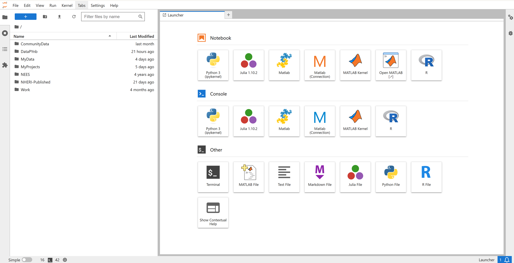
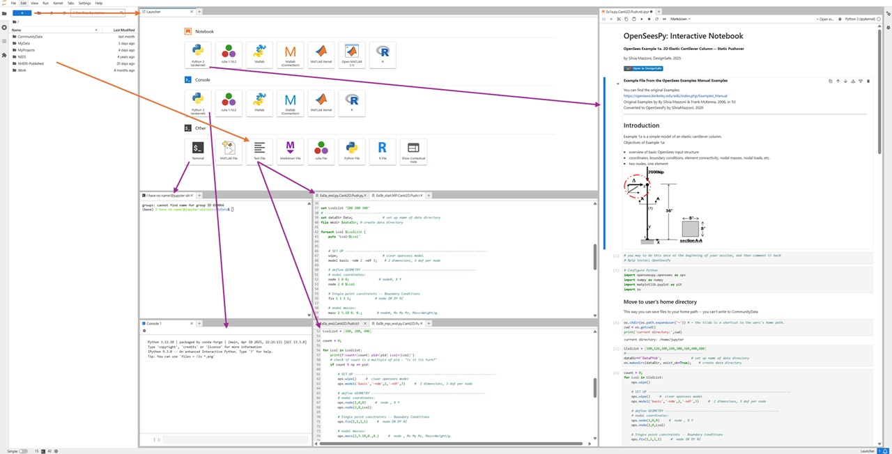

# JupyterHub Tools
***Integrated Tools in Jupyter Hub***

JupyterHub is a web-based Integrated Development Environment (IDE) that provides a unified workspace where you can manage every stage of your workflow—from editing scripts and running analyses to visualizing results—all from a single, browser-accessible dashboard, as shown in the figures below.

Each user session comes equipped with Notebooks, Consoles, Terminal Access, and text-file editors. Jupyter Hub supports **Python** like **Julia**, **MATLAB**, and **R** — useful for researchers integrating multi-language workflows.

You can click the "Open in DesignSafe" button to start a JupyterHub session -- you will be asked to log in: 

The tools can be accessed from the JupyterHub **Launcher**, shown in the figure below:

You can access the launcher by pressing the blue "+" on the top left of the Jupyter dashboard. You can launch any item by double-clicking on it.

As shown in the figures at the bottom of this page: **You can have multiple** items open symultaneously. You can arrange them as windows or as tabs.

* **Terminal**
* **Console**
* **Notebook Interface (Jupyter Notebooks)**
* **File Manager**
* **Text Editor (Code Editor)**

The following screenshot is an "extreme" example of how you can use all of these tools symultaneously:

## Summary

The Jupyter Hub environment is your **workbench for development, debugging, testing, and launching HPC jobs** — all without leaving your browser.

