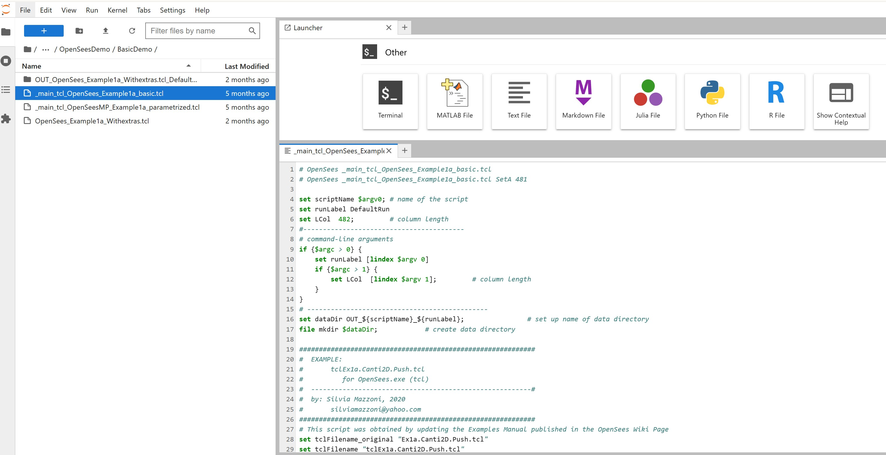

# Text Editor
***Code Editor***

* Built-in lightweight code editor with syntax highlighting for Tcl, Python, JSON, and other formats.
* Allows quick edits to scripts without switching to a notebook or terminal editor like *vim*.
* Useful for:

 * Editing input scripts
 * Creating SLURM job files
 * Modifying *metadata.json* or *app.json* files when working with Tapis

