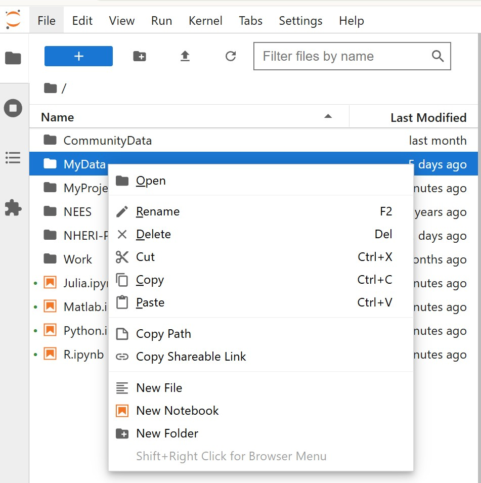

# File Manager

* Visual interface for navigating, organizing, renaming, and deleting files in your Jupyter workspace.
* Drag-and-drop support for uploading or downloading files.
* Makes it easy to keep your project folder tidy and to stage input/output files for HPC runs.

