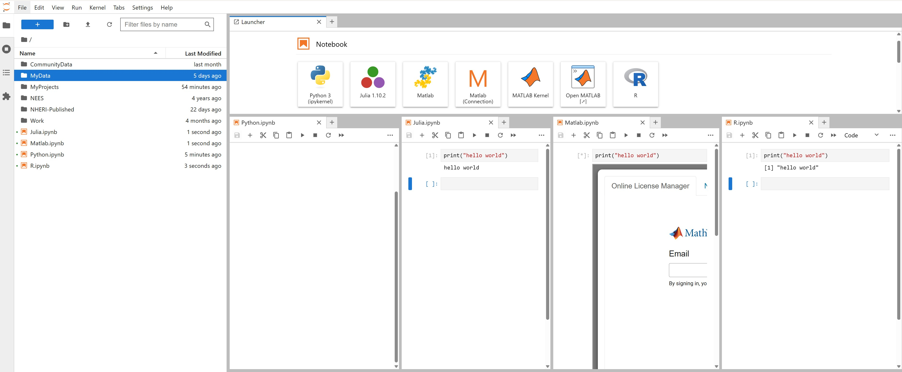

# Jupyter Notebooks

* Combines executable code, documentation, and visualizations in a single document.
* Ideal for OpenSeesPy workflows, where users can iteratively run cells, plot results, and write notes alongside their code.
* Great for **pre- and post-processing**, exploring parameter sweeps, and documenting research workflows.
* Jupyter Hub supports **Python** like **Julia**, **MATLAB**, and **R**

