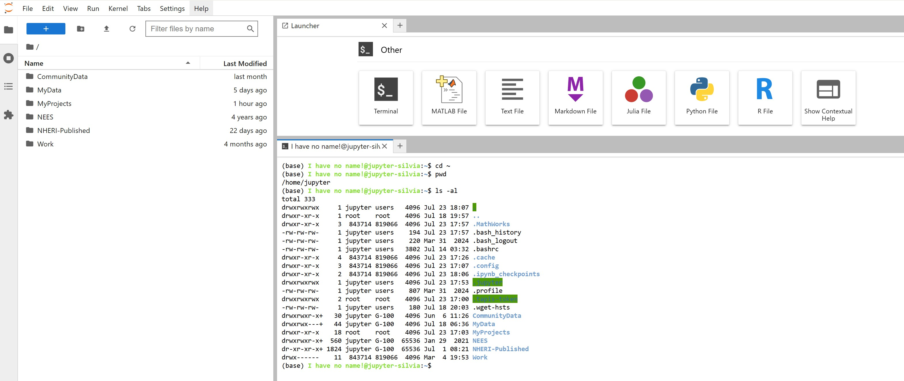

# Unix Terminal

* A full Linux command-line interface (CLI) that allows users to run OpenSees (Tcl or Python) scripts directly, compile code, use Git, or execute batch-style workflows.
* Provides **real-time error messages**, standard input/output handling, and access to the full Python and Unix toolchain.
* Especially useful for:

 * Running OpenSees, OpenSeesMP, OpenSeesSP, or OpenSeesPy jobs at the command line
 * File manipulation and quick testing
 * Using tools like *grep*, *awk*, *sed*, and *tar* for advanced scripting

