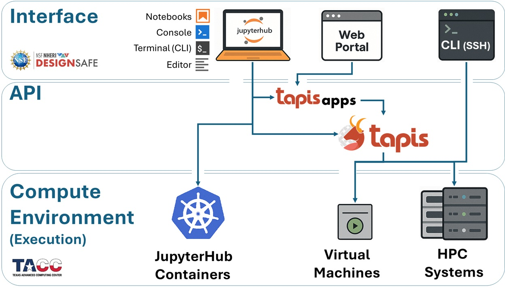

# Workflow Architecture
***Execution, Interface, and Automation***

Every computational workflow on DesignSafe follows the same underlying structure, whether you are running a quick interactive test or launching a large automated study on a supercomputer.

At a high level, all jobs move through three conceptual layers:

1. **Interface Environments** — where you interact with the system
2. **Middleware (APIs)** — how jobs are translated, staged, and managed
3. **Execution Environments** — where your code actually runs

Understanding this model is essential for making sense of how DesignSafe and TACC fit together, and for designing workflows that are **scalable, portable, and efficient**.

---

:::{dropdown} **Execution Environments** — Where Your Jobs Run
***The compute resources that execute your code***

All DesignSafe jobs ultimately run on **TACC-managed infrastructure**. The execution environment determines how much memory, how many cores, and what level of parallelism your job can use.

Depending on the size and intent of your analysis, jobs may run in one of the following environments:

1. **JupyterHub Containers (Kubernetes Cluster)**
   Designed for interactive work, prototyping, and small-scale analyses. Each user runs inside an isolated container with up to **8 CPU cores and 20 GB of RAM**. These environments are single-node and best suited for development rather than production-scale simulations.

2. **Virtual Machines (VMs)**
   Used for lightweight or specialized workloads. Some VMs are configured as **submit-only endpoints** (for example, OpenSees-EXPRESS via Tapis), while older interactive VMs have largely been replaced by JupyterHub. Like containers, these are single-node environments.

3. **HPC Systems at TACC**
   Large-scale simulations run on TACC supercomputers such as **Stampede3**, **Frontera**, **Vista**, or **Lonestar6**. These systems use the **SLURM scheduler** and support multi-node, massively parallel workloads, enabling thousands of cores and very large memory allocations.

:::

:::{dropdown} **Interface Environments** — How You Access the Compute Systems
***Where you write code, prepare inputs, and launch jobs***

Interface environments define **how you access DesignSafe and TACC resources**. They are the user-facing entry points into the system and shape how you develop, submit, and analyze jobs.

Common interface options include:

1. **JupyterHub (Kubernetes)**
   A browser-based environment for writing code, visualizing results, and programmatically submitting jobs through the Tapis API.

2. **DesignSafe Web Portal**
   A point-and-click interface for submitting jobs using preconfigured Tapis Apps (e.g., OpenSees, OpenSeesSP, OpenSeesMP). This option emphasizes ease of use over flexibility and is ideal for quick or introductory runs.

3. **SSH / Command-Line Access**
   Direct login to TACC systems for advanced users. This provides full control over files, modules, and custom SLURM workflows.

4. **Jupyter on HPC Nodes**
   A less common option that launches JupyterLab directly on an HPC compute node. While it offers access to large memory and core counts, it involves queue wait times and is generally not recommended for routine workflows.

:::

:::{dropdown} **Middleware (APIs)** — How Jobs Move Through the System
***The layer that connects interfaces to execution resources***

Between interfaces and execution environments sits the **middleware layer**, provided on DesignSafe by the **Tapis API**.

Tapis is responsible for turning user intent into executable jobs:

* receiving job requests from interfaces
* staging input data and application files
* generating scheduler directives (e.g., SLURM)
* submitting, monitoring, and managing job execution
* retrieving results when jobs complete

You may interact with Tapis in several ways:

* **Indirectly** — when using the Web Portal or preconfigured Tapis Apps
* **Semi-directly** — through scripts or notebooks using the Tapis CLI or Python libraries
* **Directly** — by calling the Tapis REST API (for example, with `tapipy`) to build automated pipelines

This middleware layer is what enables **automation, reproducibility, and scale** across the DesignSafe ecosystem.

:::

---

## The Big Picture

These three layers work together as a single pipeline:

* You interact with DesignSafe through an **interface**
* **Tapis** manages orchestration and data movement
* Your code executes on **TACC hardware**

Keeping this mental model in mind will make the rest of this documentation easier to navigate, especially as workflows grow from interactive experiments into large, automated studies.

---

## Why This Architecture Matters

Most workflow difficulties on DesignSafe are not caused by a lack of computational power, but by **mismatches between the problem being solved, the interface being used, and the execution environment selected**.

By making the system architecture explicit from the start, this guide aims to help you make informed choices about *where* your jobs run, *how* they are launched, and *which tools* are appropriate at each stage of your workflow.

