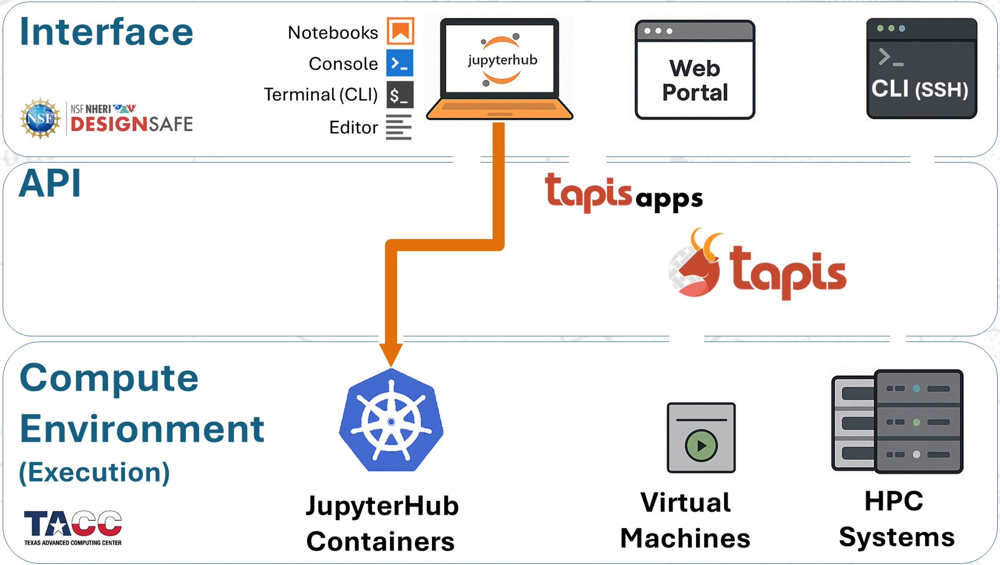
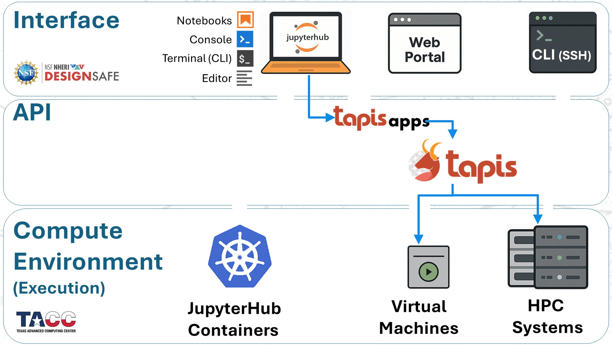

# OpenSees Workflows

In practice, there are four main ways to run OpenSees on DesignSafe:

1. **Web Portal (Tapis Apps):** Submit preconfigured jobs directly to HPC.
2. **JupyterHub (local run):** Run OpenSees interactively inside a Jupyter container.
3. **JupyterHub (HPC submission):** Stage and launch jobs to HPC using Tapis Apps from your notebooks.
4. **SSH (manual SLURM):** Log into HPC systems and submit custom batch jobs.

The diagram below illustrates how these workflows map onto the DesignSafe architecture:

  

---

## Recommendations

Because each workflow has trade-offs, here are some practical guidelines:

### 1. Run small to medium jobs within JupyterHub

* Fastest turnaround — no queue wait and no walltime limits.
* Each container provides **8 processors**.

    

### 2. Submit medium to large jobs to HPC from JupyterHub

* Recommended for heavier workloads.
* Combines the convenience of Jupyter for file and script management with the scalability of HPC resources.

    

