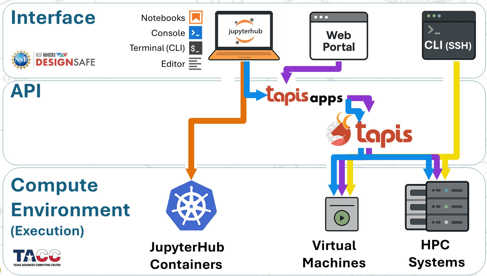

# Training Workflows

DesignSafe provides multiple computational pathways for running OpenSees analyses, each suited to different stages of research and levels of user experience. To help you choose and use these effectively, we provide three structured training modules. Each module contains detailed instructions and Jupyter notebooks that demonstrate one of the three main ways you can run OpenSees on DesignSafe:

1. **Submitting jobs from the Web Portal**

   * The simplest way to launch OpenSees jobs on HPC systems.
   * Ideal for users who want a quick, browser-based interface to submit and manage batch jobs.

2. **Running OpenSees directly in JupyterHub**

   * Provides an interactive coding environment where you can run OpenSees jobs inside Jupyter notebooks or terminals.
   * Useful for rapid prototyping, pre/post-processing, and smaller analyses that can run within JupyterHub’s allocated resources.

3. **Submitting HPC jobs via Tapis inside JupyterHub**

   * The most flexible and advanced method.
   * You can launch full HPC jobs from within JupyterHub by calling Tapis through Python or the command line, integrating job submission, monitoring, and results retrieval into one workflow.

These methods are shown in the diagram below.

These three modules illustrate that there is **no one-size-fits-all approach**. DesignSafe provides both scalable and adaptable computational environments, meaning that the “best” method depends on the type of analysis, the size of the problem, and your workflow needs. Importantly, scaling on HPC is not simply a matter of adding more nodes — some analyses benefit from massive parallelism, while others require high memory per node or GPU acceleration.

---

**Recommended Path for Getting Started**

Whether you are just beginning or preparing to optimize your use of DesignSafe, we recommend that you first go through the training modules, and then follow the following progression:

1. **Start with an MWE (Minimum Working Example).**
2. **Test the MWE in JupyterHub.**
3. **Personalize and test your script in JupyterHub.**
4. **Submit your modified script through the Web Portal.**
5. **Use Tapis to query your job metadata.**
6. **Access your analysis results in JupyterHub.**
7. **Submit the same script to HPC via Tapis.**

Following this sequence ensures you build confidence step by step: first verifying that your model works, then adapting it to your research needs, and finally scaling it efficiently across DesignSafe’s HPC systems.
